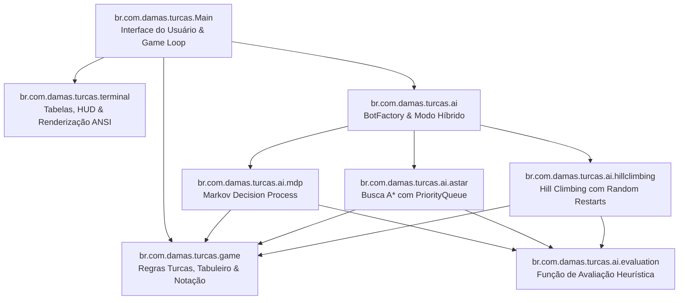

# Damas Turcas Java - Inteligência Artificial & Jogo de Damas Turcas no Terminal

[](https://openjdk.org)
[](https://www.docker.com)
[](https://github.com/features/codespaces)
[](src/test/java/br/com/damas/turcas/GameAndAITests.java)

Sistema completo para jogo de **Damas Turcas (*Turkish Draughts / Dama*)** implementado em **Java puro (JDK 21+)**, projetado para execução interativa no terminal com interface rica em tabelas Unicode e suporte a múltiplos motores de **Inteligência Artificial** desenvolvidos do zero (**Processo de Decisão de Markov**, **Busca A\*** e **Hill Climbing com Reinicialização Aleatória**).

O projeto conta com arquitetura modular, **zero dependências externas**, conformidade estrita com as **Regras Oficiais de Damas Turcas** (movimentação ortogonal para frente e para os lados), seleção de cor de peças (**Brancas** ou **Pretas**), matriz espacial configurável (**8x8** e **10x10**), histórico no HUD configurado para as **3 últimas jogadas**, comandos interativos de ajuda (`?`) e limpeza de tela (`cls`), e suporte nativo a contêineres **Docker** e **GitHub Codespaces**.

---

## Sumário

- [Visão Geral da Arquitetura](#visão-geral-da-arquitetura)
- [Estrutura do Projeto](#estrutura-do-projeto)
- [Modelagem dos Algoritmos de Inteligência Artificial](#modelagem-dos-algoritmos-de-inteligência-artificial)
  - [1. Processo de Decisão de Markov (MDP)](#1-processo-de-decisão-de-markov-mdp)
  - [2. Busca A* (A-Star Tactical Search)](#2-busca-a-a-star-tactical-search)
  - [3. Hill Climbing com Reinicialização Aleatória](#3-hill-climbing-com-reinicialização-aleatória)
  - [4. Modo Híbrido Mestre](#4-modo-híbrido-mestre)
- [Ferramentas e Bibliotecas Próprias](#ferramentas-e-bibliotecas-próprias)
  - [Motor de Tabelas e Renderização de Terminal](#motor-de-tabelas-e-renderização-de-terminal)
  - [Parser de Notação Algébrica](#parser-de-notação-algébrica)
  - [Mecanismo de Validação de Regras de Damas Turcas](#mecanismo-de-validação-de-regras-de-damas-turcas)
- [Instalação e Execução](#instalação-e-execução)
  - [Execução Nativa com Java](#execução-nativa-com-java)
  - [Execução via Docker no Windows (PowerShell)](#execução-via-docker-no-windows-powershell)
  - [Execução via Docker no Linux / macOS](#execução-via-docker-no-linux--macos)
  - [Execução no GitHub Codespaces](#execução-no-github-codespaces)
- [Suíte de Testes Automatizados](#suíte-de-testes-automatizados)

---

## Visão Geral da Arquitetura

O projeto adota uma arquitetura limpa em camadas com separação estrita de responsabilidades:



---

## Estrutura do Projeto

```
Damas_Turcas_Java/
├── .devcontainer/
│   └── devcontainer.json        # Configuração oficial para GitHub Codespaces (Java 21)
├── src/
│   ├── main/
│   │   └── java/
│   │       └── br/
│   │           └── com/
│   │               └── damas/
│   │                   └── turcas/
│   │                       ├── Main.java              # Ponto de entrada, menus e loop do jogo
│   │                       ├── game/                  # Núcleo de domínio do jogo de damas turcas
│   │                       │   ├── Board.java         # Estado do tabuleiro, clonagem e lances
│   │                       │   ├── Move.java          # Saltos simples e capturas ortogonais
│   │                       │   ├── NotationParser.java# Parser tolerante de notação algébrica
│   │                       │   ├── Piece.java         # Modelagem de peças e símbolos
│   │                       │   ├── PieceColor.java    # Enum de cores (WHITE, BLACK, NONE)
│   │                       │   ├── PieceType.java     # Enum de tipos (MAN, KING, EMPTY)
│   │                       │   ├── Position.java      # Coordenadas matriciais e notação A1-H8
│   │                       │   └── RulesEngine.java   # Regras de Damas Turcas & Lei da Maioria
│   │                       ├── terminal/              # Biblioteca própria de interface de terminal
│   │                       │   ├── Alignment.java     # Alinhamentos (LEFT, CENTER, RIGHT)
│   │                       │   ├── BorderStyle.java   # Molduras Unicode duplas, simples e ASCII
│   │                       │   ├── Colors.java        # Gerenciamento de cores e estilos ANSI
│   │                       │   ├── Renderer.java      # Tabuleiro e painel HUD (3 últimos lances)
│   │                       │   └── Table.java         # Motor genérico de tabelas com auto-largura
│   │                       └── ai/                    # Motores de Inteligência Artificial & ML
│   │                           ├── Bot.java           # Interface unificada de bots
│   │                           ├── BotFactory.java    # Fábrica e seletor de dificuldade
│   │                           ├── BotResult.java     # Encapsulamento de decisão e métricas
│   │                           ├── BotType.java       # Enum de tipos de motores de IA
│   │                           ├── astar/
│   │                           │   ├── AStarSolver.java # Algoritmo A* com Min-Heap
│   │                           │   ├── SearchNode.java  # Nós da árvore com f(n) = g(n) + h(n)
│   │                           │   └── SearchStats.java # Estatísticas de nós expandidos
│   │                           ├── evaluation/
│   │                           │   └── Evaluator.java   # Função de avaliação heurística de estados
│   │                           ├── hillclimbing/
│   │                           │   ├── ClimbStats.java  # Métricas de iterações e restarts
│   │                           │   └── HillClimber.java # Subida de encosta com Random Restarts
│   │                           ├── hybrid/
│   │                           │   └── HybridBot.java   # Modo Híbrido (A* + MDP + HC)
│   │                           └── mdp/
│   │                               ├── MDPSolver.java   # MDP com Bellman Value Iteration e Softmax
│   │                               └── MDPStats.java    # Métricas de utilidade esperada
│   └── test/
│       └── java/
│           └── br/
│               └── com/
│                   └── damas/
│                       └── turcas/
│                           └── GameAndAITests.java    # Suíte de 13 testes automatizados
├── Dockerfile                   # Build multi-stage e runtime leve em Alpine Linux
├── docker-compose.yml           # Orquestração do contêiner interativo
├── Makefile                     # Atalhos de compilação, testes e execução
├── pom.xml                      # Definição Maven padrão para Java 21+
├── run.ps1                      # Script PowerShell para execução direta no Windows
├── run.bat                      # Script Batch para Windows
├── run.sh                       # Script Bash para Linux/macOS
├── .gitignore                   # Regras de exclusão do repositório
├── README.md                    # Documentação principal da arquitetura
└── REGRAS_E_CONFIGURACOES.md    # Manual detalhado de regras e configurações
```

---

## Modelagem dos Algoritmos de Inteligência Artificial

Todas as técnicas foram desenvolvidas utilizando exclusivamente a biblioteca padrão de Java (`java.base`), sem bibliotecas ou frameworks externos de aprendizado de máquina.

### 1. Processo de Decisão de Markov (MDP)

* **Espaço de Estados ($S$)**: Representação das configurações do tabuleiro, quantificando equilíbrio material, avanço ortogonal de peças, colunas centrais e proteção de linha de base.
* **Espaço de Ações ($A(s)$)**: Conjunto de movimentos estritamente válidos segundo as regras de Damas Turcas no estado $s$.
* **Modelo de Transição Probabilística ($P(s' | s, a)$)**:
  Modela o comportamento do oponente humano através de uma distribuição de probabilidade estocástica calculada via **Softmax com Temperatura ($\tau$)** sobre as utilidades estimadas das respostas adversárias:
  $$P(a_{opp}) = \frac{\exp(V_{opp}(a_{opp}) / \tau)}{\sum_{j} \exp(V_{opp}(a_{j}) / \tau)}$$
* **Função de Recompensa ($R(s, a, s')$)**:
  Retorna ganhos imediatos baseados em capturas ortogonais, coroação a Dama Turca e variações no score posicional:
  $$R(s, a, s') = 120 \times \text{Capturas} + 200 \times \text{Promocao} + 0.5 \times \Delta \text{Score}$$
* **Cálculo da Equação de Bellman (Value Iteration)**:
  A utilidade de cada ação é projetada recursivamente ao longo de um horizonte finito com fator de desconto $\gamma = 0.90$:
  $$Q(s, a) = R(s, a) + \gamma \sum_{s'} P(s' | s, a) V(s')$$
  $$a^* = \arg\max_{a \in A(s)} Q(s, a)$$

---

### 2. Busca A* (A-Star Tactical Search)

O algoritmo A* explora em árvore o grafo de estados táticos, permitindo encontrar sequências forçadas e linhas de ganho material.

* **Fila de Prioridade (Min-Heap)**: Implementada nativamente via `java.util.PriorityQueue<SearchNode>` para gerenciar os nós abertos ordenados pela função de custo $f(n)$.
* **Custo Real Acumulado $g(n)$**:
  Penaliza a profundidade da busca e bonifica movimentos táticos imediatos:
  $$g(n) = \sum \text{Custo de Transicao} - 15 \times \text{Capturas}$$
* **Heurística Admissível $h(n)$**:
  Estima o déficit restante para atingir uma posição de vantagem dominante sobre o alvo de pontuação ($T$):
  $$h(n) = \max(0, T - \text{Avaliacao}(n))$$
* **Função de Avaliação Total**:
  $$f(n) = g(n) + h(n)$$
* **Rastreamento de Origem**: O algoritmo rastreia o movimento inicial na raiz da árvore pertencente ao caminho com menor custo $f(n)$.

---

### 3. Hill Climbing com Reinicialização Aleatória

Implementação de busca local heurística no espaço de lances com mitigação de platôs e máximos locais:

1. **Geração de Candidatos**: O algoritmo amostra movimentos legais e analisa planos considerando as piores respostas do adversário (*Minimax Local*).
2. **Subida de Encosta (Greedy Climb)**: A cada iteração, busca na vizinhança um movimento com avaliação estritamente superior.
3. **Detecção de Máximo Local / Platô**: Quando nenhum vizinho melhora a pontuação da posição atual, a subida local é finalizada.
4. **Reinicialização Aleatória (Random Restarts)**: Executa múltiplos ciclos independentes ($N = 10$ a $40$ reinicializações conforme a dificuldade) com novos pontos de partida estocásticos para convergência ao máximo global.

---

### 4. Modo Híbrido Mestre

O bot Híbrido integra os motores especializados:
* **Fase Tática**: Se houver capturas imediatas ou linhas forçadas, aciona o **A\*** para calcular a linha tática ótima.
* **Fase Estratégica**: Em posições posicionais sem capturas imediatas, executa o **MDP** para avaliar o valor esperado a longo prazo.
* **Fase de Consenso**: Utiliza o **Hill Climbing** para desempate posicional e validação de robustez defensiva.

---

## Ferramentas e Bibliotecas Próprias

### Motor de Tabelas e Renderização de Terminal
* Módulo [`Table.java`](file:///src/main/java/br/com/damas/turcas/terminal/Table.java): Criação de tabelas com suporte a títulos centralizados, cabeçalhos, alinhamentos (Esquerda, Centro, Direita) e molduras Unicode duplas (`╔╦╗`, `╠╬╣`, `╚╩╝`) ou simples (`┌┬┐`, `├┼┤`, `└┴┘`).
* Método `visibleLen`: Remove sequências de escape ANSI via Regex para calcular com precisão a largura de caracteres renderizados na tela, eliminando distorções visuais.
* Módulo [`Renderer.java`](file:///src/main/java/br/com/damas/turcas/terminal/Renderer.java): Renderiza simultaneamente o tabuleiro de Damas Turcas com contraste visual e um painel HUD lateral exibindo as **3 últimas jogadas** e métricas em tempo real.

### Parser de Notação Algébrica & Comandos Interativos
* Módulo [`NotationParser.java`](file:///src/main/java/br/com/damas/turcas/game/NotationParser.java) & [`Main.java`](file:///src/main/java/br/com/damas/turcas/Main.java): Reconhecem múltiplos formatos e comandos:
  * Formato natural: `E3 para E4`, `E3 to E4`
  * Formato espaço / hífen: `C3 D3`, `C3-D3`, `C3->D3`
  * Formato de captura / salto em cadeia: `E3:G5`, `A3:A5:C5`, `B3xB4`
  * **Guia de Ajuda (`?` ou `<?>`)**: Exibe todas as formas possíveis de comandar uma peça e lista os movimentos legais imediatos.
  * **Limpeza e Redesenho de Tela (`cls` ou `limpar`)**: Limpa o terminal e redesenha o tabuleiro e HUD atualizados.
  * **Encerramento (`sair` ou `exit`)**: Encerra a partida e retorna ao shell.

### Mecanismo de Validação de Regras de Damas Turcas
* Módulo [`RulesEngine.java`](file:///src/main/java/br/com/damas/turcas/game/RulesEngine.java):
  * **Movimentos Ortogonais**: Peças comuns movem-se 1 casa para frente, esquerda ou direita (sem diagonal nem recuo).
  * **Captura Ortogonal**: Peças comuns capturam para frente, esquerda ou direita com remoção imediata da peça saltada.
  * **Dama Turca Voadora**: Movimentação e captura livre em linha reta ortogonal (estilo Torre no xadrez).
  * **Lei da Maioria**: Restringe as jogadas legais exclusivamente àquelas com o maior número de capturas possíveis.
  * **Limite de Empate**: Empate automático após 46 rodadas completas (92 meios-lances) sem capturas.

---

## Instalação e Execução

### Execução Nativa com Java

Requer Java 21+ instalado no sistema:

```bash
# Compilar e executar diretamente
javac -d bin -sourcepath src/main/java src/main/java/br/com/damas/turcas/Main.java
java -cp bin br.com.damas.turcas.Main

# Ou utilizando o Makefile
make run
```

---

### Execução via Docker no Windows (PowerShell)

O script automatizado compila a imagem e abre o jogo interativamente:

```powershell
.\run.ps1
```

---

### Execução via Docker no Linux / macOS

```bash
# Permissão de execução no script
chmod +x run.sh
./run.sh

# Ou utilizando o docker compose
docker compose run --rm damas-turcas
```

---

### Execução no GitHub Codespaces

1. **Criar ou abrir o Codespace:**
   - No repositório GitHub, clique em **Code** > aba **Codespaces** > **Create codespace on main**.
2. **Executar o jogo no terminal do Codespace:**
   - **Opção A (Via Docker - recomendada e imediata sem instalar nada):**
     ```bash
     ./run.sh
     # ou
     make run
     ```
   - **Opção B (Via Java nativo no terminal):**
     ```bash
     make install-java
     make run
     ```

---

## Suíte de Testes Automatizados

O projeto inclui 16 testes unitários e de integração cobrindo todas as camadas:

```bash
# Executar todos os testes
make test
# Ou via Java diretamente
java -cp bin br.com.damas.turcas.GameAndAITests
```

### Resultados dos Testes:

| Teste | Módulo | Descrição | Status |
|---|---|---|:---:|
| `testBoardInitialization8x8` | `br.com.damas.turcas.game` | Inicialização da matriz padrão 8x8 (16 peças/lado) | ✅ Aprovado |
| `testBoardInitialization10x10` | `br.com.damas.turcas.game` | Inicialização da matriz ampliada 10x10 (20 peças/lado) | ✅ Aprovado |
| `testOrthogonalMovesOnly` | `br.com.damas.turcas.game` | Validação estrita de lances ortogonais (frente/lados) | ✅ Aprovado |
| `testPieceSimpleCaptureAndPromotion` | `br.com.damas.turcas.game` | Captura ortogonal e promoção na última fileira | ✅ Aprovado |
| `testMultiCaptureAndMajorityRule` | `br.com.damas.turcas.game` | Aplicação rigorosa da Lei da Maioria e saltos múltiplos | ✅ Aprovado |
| `testTurkishFlyingKingMovesAndCaptures` | `br.com.damas.turcas.game` | Movimentação e captura da Dama Turca voadora | ✅ Aprovado |
| `testNotationParser` | `br.com.damas.turcas.game` | Parsing de múltiplos formatos de entrada algébrica | ✅ Aprovado |
| `testTableRenderAndVisibleLen` | `br.com.damas.turcas.terminal` | Geração de molduras Unicode e sanitização ANSI | ✅ Aprovado |
| `testMDPSolverDecision` | `br.com.damas.turcas.ai.mdp` | Escolha ótima via Bellman Value Iteration | ✅ Aprovado |
| `testAStarSolverDecision` | `br.com.damas.turcas.ai.astar` | Busca em árvore tática com PriorityQueue | ✅ Aprovado |
| `testHillClimberDecision` | `br.com.damas.turcas.ai.hillclimbing` | Subida de encosta e Random Restarts | ✅ Aprovado |
| `testHybridBotDecision` | `br.com.damas.turcas.ai.hybrid` | Integração e consenso entre os motores de IA | ✅ Aprovado |
| `testAICapturePriority` | `br.com.damas.turcas.ai` | Cumprimento da Lei da Maioria pelos bots de IA | ✅ Aprovado |
| `testDrawAfter46Rounds` | `br.com.damas.turcas.game` | Empate automático após 46 rodadas (92 meios-lances) sem captura | ✅ Aprovado |
| `testAIPlaysAsWhiteAndBlack` | `br.com.damas.turcas.ai` | Capacidade da IA de planejar e jogar tanto de Brancas quanto de Pretas | ✅ Aprovado |
| `testDynamicRendererHUDWithPlayerColor` | `br.com.damas.turcas.terminal` | Renderização dinâmica do HUD adaptada à cor escolhida pelo jogador | ✅ Aprovado |
